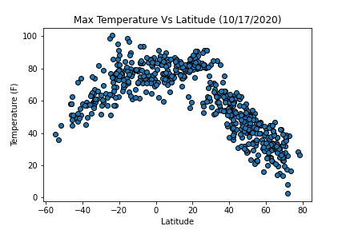
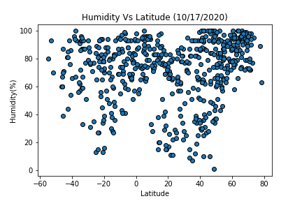
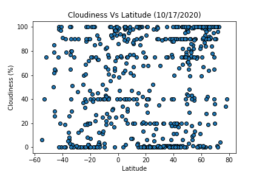
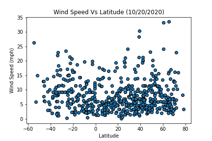

# Api-challenge

## Resources

The output file(weatherpy.csv) in the weatherpy folder is used for Vacationpy. Outside of that the following software is used to complete the analysis.

* Python 3.7.4
* matplotlib 3.2.2
* pandas 1.0.5
* scipy 1.5.0
* numpy 1.17.0
* citipy 0.0.5
* Jupyter notebooks to display code
* gmaps widget to show heatmap and markers

## Submission

The submission are the weatherpy and vacationpy directories. Analysis of the weatherpy folder will be below.

### Weatherpy

Within the weatherpy directory holds the weatherpy jupyter notebook. An output folder is presented to hold the csv needed for Vacationpy and the plots created. The plots created are the following:

* Max Temperature vs Latitude
* Humidity vs Latitude
* Cloudiness vs Latitude
* Wind Speed vs Latitude

The script will utilize the openweatherapi to pull the information needed in creating a dataframe. Weatherpy also contains information from the linear regression analysis for the main plots. The linear regression analysis splits the latitude into the two hemispheres(Northern and Southern). The regression lines will be used in identifying any observations in the four plots.

### Vacationpy

Within the Vacationpy directory holds the vacationpy jupyter notebook. This file will use the weatherpy csv and will determine hotel locations based on certain parameters. The goal is to identify cities that would make for good vacation spots and hotels within the area. This will utilize a google api and google maps. The markers on the map will show the hotel name, the city, and the country. Along with markers on the map, there is also a heatmap. The heatmap is weighted by humidity, the more humid the city the darker it would be.

### Weatherpy observations

With a linear regression on the four plots there are some interesting observations.

1. There is a strong correlation involved with the temperature and latitude. A strong positive correlation when examining the southern hemisphere (latitude < 0), as well as a strong negative correlation for the northern hemisphere (latitude >= 0). This makes sense as latitude = 0 is the equator and is the hottest latitude on the globe.

2. For humidity vs latitude, the northern hemisphere has a weak positive correlation with latitude. The farther the city is from the equator, the more humid. For the southern hemisphere has a weak negative orientation. The closer to the equator, the less humid each city is. In other words the closer to the equator the less humid the city is.

3. For cloudiness, the northern hemispere has a weak positive correlation with latitude. The southern hemisphere also has a weak positive correlation with latitude. This trend is interesting. a guess is that the latitude does not affect cloudiness. Another guess through the correlation coefficient is that the farther north, the cloudier it gets.

4. For wind speed, the northern hemisphere has a weak positive correlation and the southern hemisphere has a weak negative correlation. Based on the correlation coefficient the closer to the equator, the less windy. Another notable observation is that many of the cities are clustered together below 20 mph. With this cluster exists outliers, which begs the question on whether latitude is a factor.
